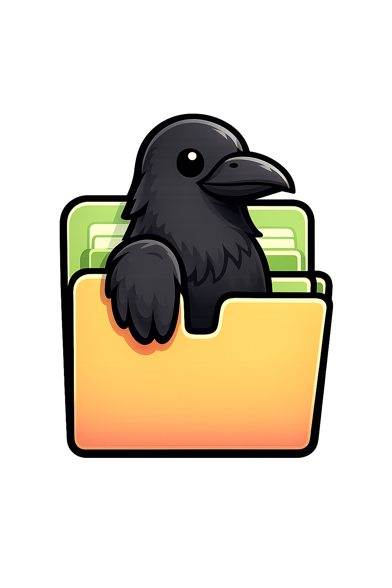
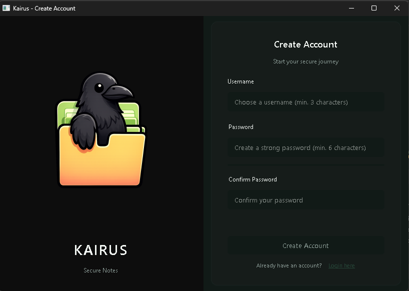
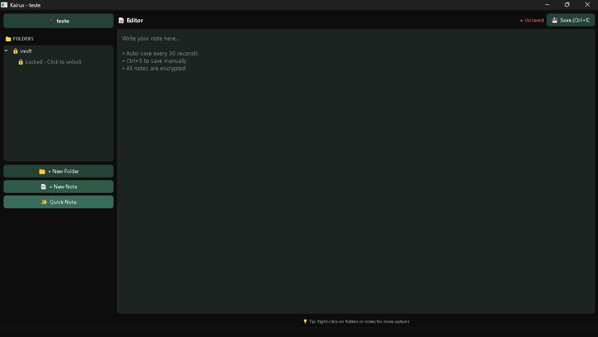

# KAIRUS

<div align="center">



# KAIRUS

> Aplicativo de anotações seguras com criptografia de nível militar.
> 100% offline. Privacidade em primeiro lugar.

</div>

---

# 📸 Interface

## Tela de Cadastro

<div align="center">
  
</div>

---

## Dashboard

<div align="center">
  
</div>

---

# 🔐 Funcionalidades

## Criptografia AES-256

Todas as anotações são protegidas utilizando AES-256-CBC com práticas modernas de criptografia.

* Criptografia AES-256-CBC
* Derivação de chave PBKDF2
* 100.000 iterações
* Salt único por criptografia
* Padding PKCS7

---

## 📁 Pastas Protegidas por Senha

Organize suas anotações em pastas seguras com senhas personalizadas.

* Proteção individual por pasta
* Hash seguro de senhas
* Armazenamento criptografado local

---

## 💾 Salvamento Automático Inteligente

KAIRUS salva automaticamente seu trabalho para evitar perda de dados.

* Sistema de auto-save
* Recuperação automática
* Fallback para Vault

---

## 🚀 Captura Rápida de Notas

Crie notas instantaneamente de qualquer lugar utilizando um atalho global.

| Ação       | Atalho          |
| ---------- | --------------- |
| Quick Note | `Ctrl + Insert` |

---

## 📄 Exportação de Arquivos

Exporte suas anotações rapidamente.

Formatos suportados:

* PDF
* TXT

---

## 🔒 100% Offline

KAIRUS funciona totalmente offline.

* Sem nuvem
* Sem rastreamento
* Sem telemetria
* Sem assinaturas
* Controle total dos dados localmente

---

# 🛡️ Arquitetura de Segurança

KAIRUS foi desenvolvido com foco em proteção de dados locais e privacidade do usuário.

```text
╔══════════════════════════╗
║   AES-256-CBC            ║
║   PBKDF2 (100k iters)    ║
║   Salt Único por Nota    ║
║   PKCS7 Padding          ║
╚══════════════════════════╝
```

## Detalhes da Criptografia

| Componente                | Implementação               |
| ------------------------- | --------------------------- |
| Algoritmo de Criptografia | AES-256-CBC                 |
| Derivação de Chave        | PBKDF2                      |
| Iterações                 | 100.000                     |
| Padding                   | PKCS7                       |
| Estratégia de Salt        | Salt único por criptografia |

---

# ⌨️ Atalhos do Teclado

| Ação                      | Atalho             |
| ------------------------- | ------------------ |
| Salvar Nota               | `Ctrl + S`         |
| Nova Nota                 | `Ctrl + N`         |
| Nova Pasta                | `Ctrl + Shift + N` |
| Quick Note Global         | `Ctrl + Insert`    |
| Focar na Árvore de Pastas | `Ctrl + F`         |
| Atualizar                 | `F5`               |
| Limpar Editor             | `Ctrl + W`         |
| Excluir Item              | `Delete`           |

---

# ❓ FAQ

## O KAIRUS é realmente gratuito?

Sim. O KAIRUS pode ser utilizado gratuitamente.

---

## Posso sincronizar notas entre dispositivos?

Atualmente não. O sistema foi projetado para funcionar localmente e offline.

---

## O que acontece se eu esquecer minha senha?

Por motivos de segurança, senhas não podem ser recuperadas. As criptografias foram projetadas para impedir acesso não autorizado.

---

## O KAIRUS está disponível para Mac ou Linux?

Atualmente o foco principal é Windows 10 e 11.

---

## O quão segura é a criptografia?

KAIRUS utiliza AES-256-CBC com PBKDF2 e 100.000 iterações, seguindo práticas modernas de segurança para proteção local de dados.

---

## Posso exportar minhas anotações?

Sim. É possível exportar notas em PDF ou TXT.

---

# ⚙️ Requisitos

* Python 3.8+
* Windows 10/11
* 100MB de espaço livre

---

# 🧩 Estrutura do Projeto

```bash
KAIRUS/
│
├── build/
├── core/
├── dist/
├── security/
├── storage/
├── ui/
├── utils/
├── web/
│   ├── css/
│   └── img/
│
├── main.py
├── kairus.spec
├── requirements.txt
├── build.bat
└── README.md
```

---

# 🛠️ Tecnologias

* Python
* AES-256 Encryption
* PBKDF2
* Armazenamento Local
* Exportação PDF/TXT

---

# 📜 Licença

Este projeto está licenciado sob a licença MIT.

---

<div align="center">

# KAIRUS

Secure Note Taking for the Privacy-Conscious.

© 2024 KAIRUS — Todos os direitos reservados.

</div>
